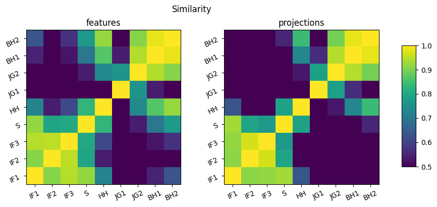

# Neural Audio Embeddings through Contrastive Learning

An exploration of transforming music into meaningful representations that can be used for downstream tasks such as song recommendation. Checkout out an [online demo](https://parrot-339477725714.europe-north1.run.app) of the concept (see the [Demo section](#demo) for a detailed description). 

### Introduction
Contrastive (or self-supervised) learning can be used to train AI models to encode data into new representations, which can be more expressive when it comes to solving different problems. The core concept is to develop a model by providing guidance through comparison rather than explicit labels (as is done in supervised learning). Multiple works have shown that the representations obtained through contrastive learning can serve as high quality features that can be used as an entry point when learning specific, related tasks. [\[1,](#1) [2,](#2) [3,](#3) [4\]](#4)

A hypothesis going into this project is that in the context of music, tracks that are in the same playlist likely have things in common. The results support this, and show that useful track representations emerge when training a neural network on audio from songs, with the sole learning signal being an indication of whether two songs are in the same playlist. It is possible to find similar tracks through similarity search by finding the nearest neighbours among these representations. Related use cases could be playlist continuation - to predict the next likely song from a sequence of tracks.

### Method

A transformer based neural network, inspired by Whisper [[5]](#5), was used to encode audio into representations (see [model.py](src/spotifai/maching_learning/model.py) for details). The model was trained using a contrastive learning method called Barlow twins [[6]](#6), which has been modified here to work with multiple positive examples per batch, instead of a single pair.

The audio was first preprocessed into spectrograms, or patches in the frequency-domain, of equal size (see [audio_processor.py](src/spotifaiaudio/audio_processor.py) for details). Usually, since the patch length is between 5s and 10s, a single audio clip would produce multiple patches. During a single training step, tracks from multiple playlists were sampled and preprocessed. The training objective was to maximize the cosine similarity between representations obtained from patches from tracks in the same playlist (including patches from the same track), and to minimize the similarity between the rest.

A local dataset was used which contains a collection over 500k tracks and of 200k playlists. The model was trained on a consumer GPU (RTX 2060), which limited both the model size and the batch size. In total 1.8M steps or model updates were performed.

### Results
The training process was stable, with the validation loss following the training loss (see figure).


A simple exploration of the resulting audio representations for a cherry-picked selection of songs follows (please note that majority of tracks are likely in-sample). Biased by my own taste in music, I was intrigued to see whether the model could successfully separate genres and styles. The following figure shows the similarity between different songs for two types of model outputs. The model features are an intermediate, inner representation of the model, and the projections are the final output.

| Symbol | Artist | Title | Style |
| :---  | :----- | :---- | :---- |
| IF1   | In Flames       | Swim                             | Metal             |
| IF2   | In Flames       | Delight and Angers               | Metal             |
| IF3   | In Flames       | Clayman                          | Metal             |
| S     | Soilwork        | Long Live the Misanthrope        | Metal             |
| HH    | Håkan Hellström | Känn Ingen Sorg För Mig Göteborg | Pop / Rock        |
| JG1   | José Gonzáles   | Heartbeats                       | Singer-Songwriter |
| JG2   | José Gonzáles   | Lovestain                        | Singer-Songwriter |
| BH1   | Beach House     | Space Song                       | Dream Pop         |
| BH2   | Beach House     | PPP                              | Dream Pop         |



A higher value indicates a higher similarity between the tracks according to the model. Early results indicate that the projection could be a more suitable representation to consult, since it is more discriminative than the intermediate feature representation. However, both simialrity matrices are very similar.

It is positive that different tracks from the same artist seem to score high in similarity, and that there are connections within genres as well. Interestingly, the model finds that a pop/rock artist (Håkan Hellström) shares a small relevance with both the metal cluster and the set of softer songs from Beach House.  


## Demo

An example of a related use case - a music recommendation app - can be explored at https://parrot-339477725714.europe-north1.run.app (note that due to cold starts, where the server needs to boot up from a resting state, there might be a longer delay of 30s-60s before the application is up and running - try reloading the page if it is not responding). The application allows you to search for your favorite songs, and makes suggestions on similar music. 


To develop the web app, a collection of music has been analysed by the AI model and the extracted representations have been stored in a vector databse. The closest matches for each song can then be computed when exploring specific tracks.

There are some limitations, most notably a non-exhaustive dataset, which means that you might not find the specific song you are looking for. See the following list for a full understanding.

**Future app improvements:**
- Expand dataset: include more tracks.
- Analyze full song: right now a small part of each track is analyzed, which might not be representative of the entire song.
- Cold starts: reduce long initialization times.
- Advanced search:
    - Order search results by relevance.
    - Account for misspellings.
    - Add support for multiple keywords: currently you can search for either title, artist or album, but not a combination thereof.
- Increase limited number of results: add pagination / infinite scroll.
- Include track popularity during model training: right now the model does not care if a song is good or bad, at least not explicitly.


## Setup

In order to train or apply a model, access to a music dataset containing audio clips is required. This repository excpects a connection to a SQLite database corresponding to the implementations in [schema.sql](src/spotifai/database/schema.sql) and [music_database.py](src/spotifai/database/music_database.py).

Installation (requires python):
```bash
pip install git+https://github.com/filhei/spotifai
```

Setup an experiment by creating a new directory under ```experiments/``` and add a modified copy of the [config file](experiments/example/config.json).

Train a model:
```python
from spotifai.maching_learning.train import train_model
experiment_path = "experiments/example"

train_model(
    experiment_path=experiment_path,
    device="cpu", # "cuda" if a GPU is available
    mixed_precision=True,
    multi_processing=True,
)
```

## Technologies
- **PyTorch**: AI model
- **Flutter**: web app
- **SQLite**: music dataset
- **ChromaDB**: representations dataset
- **Docker**: deployment


## References
<a id="1">[1]</a> 
Chen, Ting, et al. "A simple framework for contrastive learning of visual representations." International conference on machine learning. PmLR, 2020. https://arxiv.org/abs/2002.05709

<a id="2">[2]</a> 
Grill, Jean-Bastien, et al. "Bootstrap your own latent-a new approach to self-supervised learning." Advances in neural information processing systems 33 (2020): 21271-21284. https://arxiv.org/abs/2006.07733

<a id="3">[3]</a>
Chen, Xinlei, and Kaiming He. "Exploring simple siamese representation learning." Proceedings of the IEEE/CVF conference on computer vision and pattern recognition. 2021. https://arxiv.org/abs/2011.10566

<a id="4">[4]</a>
Radford, Alec, et al. "Learning transferable visual models from natural language supervision." International conference on machine learning. PmLR, 2021. https://arxiv.org/abs/2103.00020

<a id="5">[5]</a>
Radford, Alec, et al. "Robust speech recognition via large-scale weak supervision." International conference on machine learning. PMLR, 2023. https://arxiv.org/abs/2212.04356

<a id="6">[6]</a>
Zbontar, Jure, et al. "Barlow twins: Self-supervised learning via redundancy reduction." International conference on machine learning. PMLR, 2021. https://arxiv.org/abs/2103.03230
